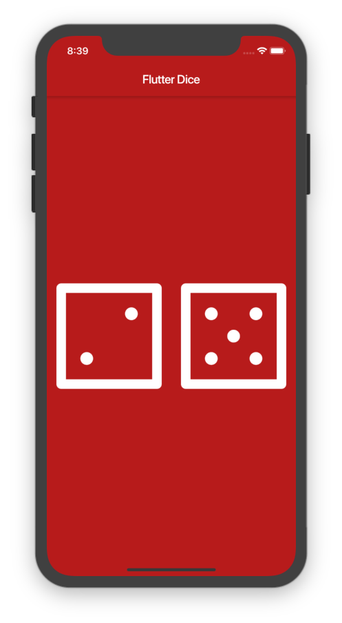

    

# Flutter Dice

A cross platform mobile application for rolling dice. Demonstrates stateless and stateful widgets usage including gesture controls. Developed using Flutter.

### Library Used

- Material
- Dart Math

### Widgets / Classes Used

- Scaffold
- Row
- AssetImage
- Colors
- Expanded
- FlatButton